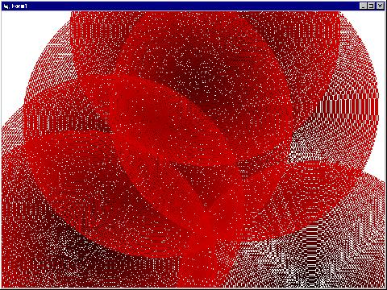



## cool colorful image thingy\!\!\!

### Description

This program makes cool circle designs you can print. Could be used to teach random numbers, circles, colors, and circles to beginners.
 
### More Info
 

             |
---                |---
**Submitted On**   |2004-07-13 18:24:02
**By**             |[misic189](https://github.com/Planet-Source-Code/PSCIndex/blob/master/ByAuthor/misic189.md)
**Level**          |Beginner
**User Rating**    |5.0 (10 globes from 2 users)
**Compatibility**  |VB 6\.0
**Category**       |[Graphics](https://github.com/Planet-Source-Code/PSCIndex/blob/master/ByCategory/graphics__1-46.md)
**World**          |[Visual Basic](https://github.com/Planet-Source-Code/PSCIndex/blob/master/ByWorld/visual-basic.md)
**Archive File**   |[cool\_color1769407132004\.zip](https://github.com/Planet-Source-Code/misic189-cool-colorful-image-thingy__1-54929/archive/master.zip)

